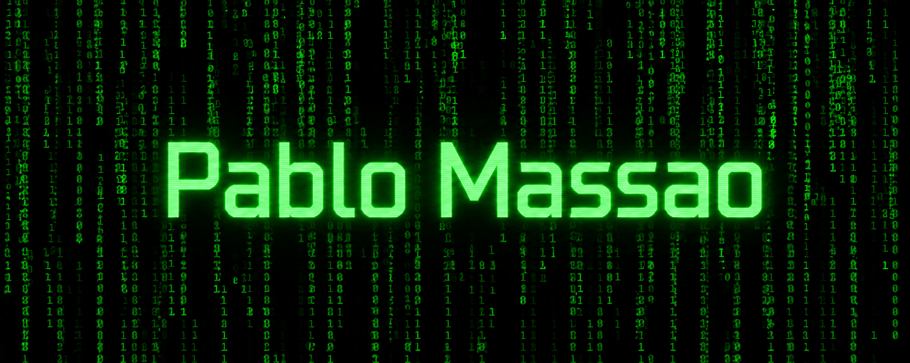

<div align="center">
  
</div>
<h3 align="center">
Desenvolvedor Full Stack | PHP • JavaScript
</h3>
<p align="center">
Construindo aplicações escaláveis, APIs e soluções para negócios.
</p>

```php
class AboutMe
{

    public string $name = "Pablo";
    public array $pronouns = ["ele", "dele"];

    public string $profession = "Full Stack Developer";

    public array $preferredTechStack = ["php", "mysql", "javascript"];
    public array $canUse = ["react", "docker", "postgres", "mongodb"];

    public string $motto = "Bom software = boas práticas + colaboração + entrega de valor";
}
```
---

## 📊 Minhas estatísticas no GitHub

<div align="center">
  
  
<!-- 🐍 Cobrinha que come os commits — gerada automaticamente pela GitHub Action abaixo -->


   
   
    
</div>


---

### 💻 Tecnologias

<p align="center">

</p>

---

## 🚀 Principais Projetos

Em breve...

---

<p align="center">
<picture>
  <source media="(prefers-color-scheme: dark)" srcset="https://raw.githubusercontent.com/pablo-ads-dev/pablo-ads-dev/output/github-snake-dark.svg" />
  <source media="(prefers-color-scheme: light)" srcset="https://raw.githubusercontent.com/pablo-ads-dev/pablo-ads-dev/output/github-snake.svg" />
  
</picture>
</p>
