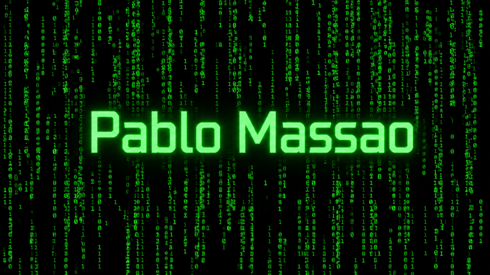

<h3 align="center">
Desenvolvedor Full Stack | PHP • JavaScript
</h3>

Construindo aplicações escaláveis, APIs e soluções para negócios.

<table>
<tr>
<td width="100%">

## 👨‍💻 Sobre mim

Sou um desenvolvedor Full Stack apaixonado por tecnologia e por transformar ideias em soluções. Gosto de investir meu tempo construindo aplicações, desenvolvendo novas funcionalidades e, principalmente, resolvendo problemas. Estou sempre buscando evoluir, seja escrevendo código mais limpo, escalável e eficiente, seja aprimorando minhas habilidades de comunicação com usuários, clientes e equipes. Acredito que um bom software é resultado não apenas de boas práticas de desenvolvimento, mas também de colaboração, aprendizado contínuo e foco em entregar valor.

</td>
</tr>
</table>

### 💻 Técnologias

---

## 🚀 Principais Projetos

Em breve...

---

## 🌎 Onde me encontrar

---

